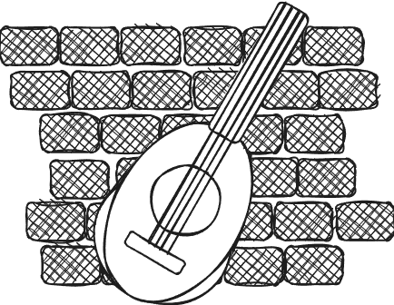

<p align="center">
      
      <h1 align="center" style="color:#d5a021ff;font-family: 'Franklin Gothic Medium', 'Arial Narrow', Arial, sans-serif;transform-origin: top right;text-shadow: 0px 0px 8px rgba(0, 0, 0, 256);">LUTE</h1>
      <p align="center">Lute is a self-hosted streaming service, with a focus on concurrent listening,
      implemented in <a href="https://go.dev">Go</a>.</p>
</p>

## Quickstart

You can use the `docker-compose.yaml` in this repo to quickly start up Lute:

```sh
docker compose up -d
```

Lute will then be available in your browser at `localhost:5173`! 

## Configuration

You can configure the Lute backend using the `lute.config.json` file or command-line arguments.

Command-line arguments take precedent over the JSON configuration, allowing you to override your default
configuration at runtime:

```bash
lute -h
Usage of lute:
  -debug
        Run Lute in debug mode.
  -grpc int
        The port that Lute should use for gRPC requests. (default 50051)
  -host string
        The hostname or address that the Lute backend should listen on. (default "127.0.0.1")
  -http int
        The port that Lute should use for HTTP requests. (default 8080)
  -pg string
        The hostname or address of the PostgreSQL database. (default "127.0.0.1")
  -pg-port int
        The port of the PostgreSQL database. (default 5432)

lute -host 192.168.100.1 -http 80
```

### JSON Configuration
The JSON configuration in `lute.config.json` sets the default values that Lute will startup with:

```json
{
    "lute": {
        "host": "127.0.0.1",
        "grpc": 50051,
        "http": 8080
    },
    "postgres": {
        "host": "127.0.0.1",
        "port": 5432
    },
    "uploads": "uploads/",
    "debug": false
}
```

#### Variables

| Variable | Description | Default |
|----------|-------------|---------|
| lute.host | The hostname or address that the Lute backend should listen on. | `"127.0.0.1"` |
|lute.grpc | The port that Lute should use for gRPC requests. | `50051` |
| lute.http | The port that Lute should use for HTTP requests. | `8080` |
| postgres.host | The hostname or address of the PostgreSQL database. | `"127.0.0.1"` |
| postgres.port | The port of the PostgreSQL database. | `5432` |
| debug | Toggles debug mode. **WARNING: This will log secrets!** | `false` |
| uploads | The path that Lute should store uploaded files in. | `"uploads"` |

## Contributing

### API

Lute makes use of [gRPC](https://grpc.io/docs/what-is-grpc/core-concepts/) and 
[protocol buffers](https://protobuf.dev/) to implement its API. To contribute
to the API, your development environment will require a protocol buffer compiler
and Go and Typescript-specific plugins for protocol buffers and gRPC.

You can [install `protoc`, a protocol buffer compiler](https://grpc.io/docs/protoc-installation/), 
from pre-compiled binaries. Check the documentation for specific instructions 
for your OS.

```bash
# Using apt:
apt install -y protobuf-compiler

# Using Homebrew
brew install protobuf
```

`protoc` requires [plugins](https://github.com/protocolbuffers/protobuf-go) 
to compile protocol buffers into the Go-specific gRPC implementation.

```bash
go install google.golang.org/protobuf/cmd/protoc-gen-go@latest
go install google.golang.org/grpc/cmd/protoc-gen-go-grpc@latest
```

#### Compiling Protocol Buffers for the Backend

You can compile protocol buffers in this project with `protoc`. Generally,
`.proto` files will be found in the [`api/proto`](api/proto) directory.

```bash
# this will output the generated files to gen/
protoc --go_out=gen --go_opt=paths=source_relative \ 
    --go-grpc_out=gen --go-grpc_opt=paths=source_relative \
    api/proto/* 

# if you need to be more specific:
protoc --go_out=gen/stream --go_opt=paths=source_relative \ 
    --go-grpc_out=gen/stream --go-grpc_opt=paths=source_relative \
    api/proto/stream.proto 
```

#### Compiling Protocol Buffers for the Frontend

You can compile protocol buffers for the frontend using [`buf.build`](https://buf.build/docs/). Generally,
`.proto`files will be found in the [`api/proto`](api/proto) directory.


```bash
# you can install buf with npm
npm install -g @bufbuild/buf @bufbuild/protoc-gen-es

# and then generate the protocol buffers for the frontend
npx buf generate
```
